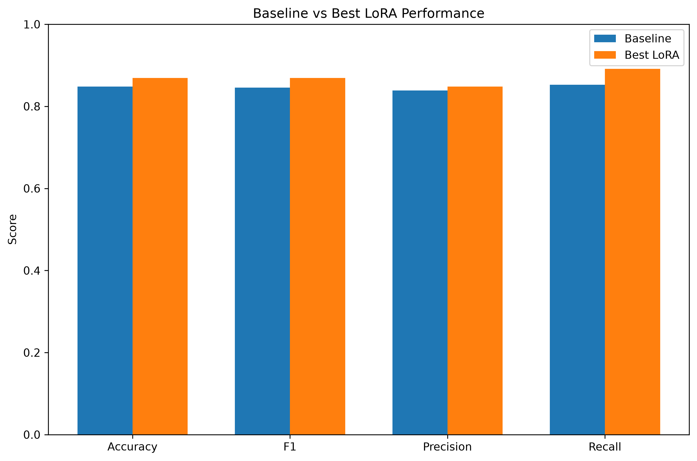
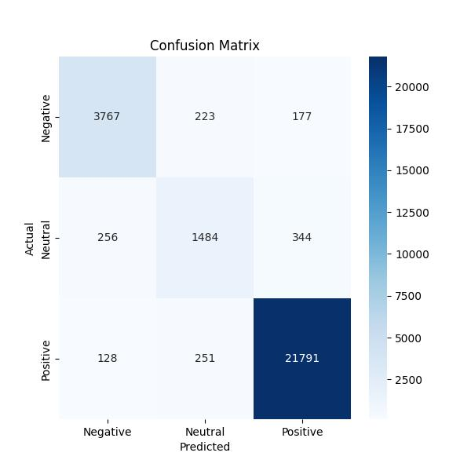

# LoRA Sentiment Analysis with DistilBERT

Optimizing DistilBERT for a binary sentiment classification task, with LoRA (Low-Rank Adaptation) and PyTorch and Hugging Face.

In this project, we investigate the parameter-efficient fine-tuning through the comparison of DistilBERT baseline model with several LoRA configurations. The final verified model was able to achieve 86.30% accuracy in the test set of 1000 reviews, whilst minimizing the number of trainable parameters required when fine tuning the model.

---

## Project Overview

In this project, a complete Natural Language Processing (NLP) pipeline is illustrated:

* Use Preprocessing and Tokenization to prepare a sentiment analysis dataset.
* Trained a baseline DistilBERT sequence classification model
* Fine-tune with LoRA (Low-Rank Adaptation)
* Discuss differences between various LoRA sets (LR, LR2, LR3)
* Explore Accuracy, Precision, Recall, F1 Score, and a Confusion Matrix for evaluation
* Export the final model for inference to unseen text

---

## Final Results

| Metric        | Baseline | Final LoRA |
| ------------- | -------: | ---------: |
| **Accuracy**  |   84.80% | **86.30%** |
| **Precision** |   83.79% | **86.64%** |
| **Recall**    |   85.25% | **85.04%** |
| **F1 Score**  |   84.55% | **85.83%** |

**Overall improvement:** **+1.50 percentage points** in accuracy over the baseline model.

---

## Model Performance

> **Replace the placeholder below with your performance graph.**



---

## Confusion Matrix

The final LoRA model was evaluated on **1,000** test samples.

|                     | Predicted Negative | Predicted Positive |
| ------------------- | -----------------: | -----------------: |
| **Actual Negative** |            **448** |                 64 |
| **Actual Positive** |                 73 |            **415** |

The model correctly classified **863 out of 1,000** reviews.

> **Replace the placeholder below with your confusion matrix image.**



---

## LoRA Configuration

| Parameter          | Value                   |
| ------------------ | ----------------------- |
| Base Model         | DistilBERT              |
| Task               | Sequence Classification |
| LoRA Rank          | 16                      |
| LoRA Alpha         | 32                      |
| Target Modules     | `q_lin`, `v_lin`        |
| Best Configuration | **LR2**                 |

---

## Example Predictions

| Input                                                              | Prediction   | Confidence |
| ------------------------------------------------------------------ | ------------ | ---------: |
| *This movie was absolutely fantastic. I loved every minute of it.* | **POSITIVE** |     99.62% |
| *The movie was boring, predictable, and disappointing.*            | **NEGATIVE** |     99.38% |
| *I really enjoyed this product and would definitely recommend it.* | **POSITIVE** |     99.47% |
| *Terrible experience. I regret buying this.*                       | **NEGATIVE** |     94.60% |
| *It was okay, nothing special but not terrible either.*            | **POSITIVE** |     81.51% |

---

## Repository Structure

```text
LoRA-Sentiment-Analysis/
├── 01_baseline.ipynb
├── final_lora_model/
├── results/
├── baseline_vs_lora_performance.png
├── final_lora_comparison.csv
├── baseline_classification_report.txt
├── lora_classification_report.txt
├── predict.py
├── requirements.txt
└── README.md
```

---

## Technologies Used

* Python
* PyTorch
* Hugging Face Transformers
* PEFT (LoRA)
* DistilBERT
* scikit-learn
* Jupyter Notebook

---

## Future Improvements

* Evaluate additional transformer architectures (BERT, RoBERTa)
* Perform hyperparameter optimization for LoRA rank and learning rate
* Deploy the model as a web application using Streamlit or FastAPI
* Expand to multi-class sentiment classification
